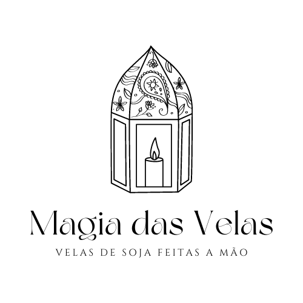

# projeto-4-5

 

    

  <h3 align="center">Magia das velas</h3>

  

   Loja de velas aromáticas 100% veganas e artesanais.
     
    <a href=""><strong>Acessar demonstração »</strong></a>
  

  <h4 align="center"> 
    🚧  Projeto em desenvolvimento  🚧
  </h4>

# Autor
Yumi Kawano - yumikawano@outlook.com

https://www.linkedin.com/in/yumi-kawano/

# Licença

Este projeto esta sobe a licença MIT. Veja [LICENSE](https://github.com/yumikawano/projeto-4-5/blob/main/LICENSE) para mais informações.